# Онлайн-маркетплейс

## Описание проекта

Веб-приложение онлайн-маркетплейса — платформы, где независимые продавцы размещают товары, а покупатели выбирают и заказывают их через единый каталог. Система обеспечивает управление товарами, оформление заказов, оставление отзывов и аналитику продаж. Серверная часть реализована на Go с использованием PostgreSQL и Redis.

## Цель и решаемая задача

Цель — дать независимым продавцам единое место для публикации товаров и обработки продаж, а покупателям — возможность находить товары разных продавцов, оформлять покупку и оставлять отзыв после получения. Платформа ведёт каталог и заказы, не владея товарами продавцов. Для учебного проекта оплата имитируется встроенным Mock Bank.

## Требования к системе

### Функциональные

| ID | Требование |
| --- | --- |
| F-1 | Гость просматривает каталог, категории, карточку товара, историю его цены и отзывы. |
| F-2 | Покупатель управляет адресами и единственной корзиной в статусе `draft`, добавляет товары и меняет их количество. |
| F-3 | При оформлении система проверяет адрес и доступный остаток, резервирует товары, фиксирует цены и создаёт один `pending`-заказ на каждого продавца в корзине. При ошибке оформление не меняет корзину и остатки. |
| F-4 | Покупатель оплачивает `pending`-заказ через учебный Mock Bank и может отменить заказ до отправки; продавец переводит оплаченный заказ в `shipped`, затем в `delivered`. |
| F-5 | Продавец управляет своими товарами и просматривает продажи и статистику за период. Администратор управляет пользователями и категориями; аналитик просматривает отчёты. |
| F-6 | Покупатель оставляет не более одного отзыва на товар и только после доставки содержащего этот товар заказа. |

### Ключевые нефункциональные

Это **целевые критерии**, а не результаты уже выполненных измерений. Стенд для проверки: ноутбук с Intel Core i5-13500H, 16 ГБ RAM, Ubuntu 24.04; Go-приложение и PostgreSQL/Redis запускаются локально. Объём данных и порядок измерений ниже нужны для воспроизводимой проверки в следующих лабораторных.

NF-P, NF-R и NF-S вместе с указанным стендом приняты студентом 30.09.2026
как цели будущих проверок. Их достижение пока не измерялось.

| ID | Свойство | Измеримый критерий и способ проверки |
| --- | --- | --- |
| NF-P | Производительность | При 10 000 активных товаров, после прогрева, за 5 минут нагрузки от 20 одновременных клиентов `GET /api/v1/products?page=1&limit=20` имеет p95 времени ответа не более 500 мс и менее 1% ответов 5xx. |
| NF-R | Надёжность | Если Redis отключить после запуска приложения при работающей PostgreSQL, не менее 99% из 100 последовательных запросов `GET /api/v1/products/{id}` для существующего товара должны завершиться ответом 2xx. |
| NF-S | Безопасность | В наборе из 50 запросов на изменение данных по защищённым API-маршрутам без токена или с ролью без права доступа — 0 успешных изменений; ответы имеют статус 401 или 403. Учебный платёжный callback проверяется отдельно и не входит в этот набор. |

## Предметная область

Онлайн-маркетплейс — это электронная торговая площадка, на которой множество независимых продавцов размещают свои товары, а покупатели выбирают и заказывают их через единый интерфейс. В отличие от классического интернет-магазина, маркетплейс не владеет товарами, а выступает посредником: предоставляет каталог с категориями, систему заказов, отзывы и рейтинги. Ключевые бизнес-процессы включают регистрацию продавца, публикацию товара, оформление заказа покупателем, отслеживание статуса доставки и формирование аналитической отчётности.

## Анализ аналогов

Для сравнения выбраны три крупнейших маркетплейса, доступных российским пользователям. Критерии отражают программные характеристики платформ, значимые при проектировании собственной системы.

**Критерий 1 — API для продавцов.** Наличие и зрелость публичного API определяет возможность автоматизации и интеграции со сторонними системами (1С, CRM, аналитические сервисы). Это ключевая техническая характеристика платформы для продавцов.

**Критерий 2 — Встроенная аналитика продаж.** Возможность получить статистику продаж, выручки и динамику заказов средствами самой платформы, без покупки сторонних сервисов. Различия между платформами здесь существенны.

**Критерий 3 — Система рейтингов и отзывов.** Архитектура системы обратной связи: наличие раздельных рейтингов товара и продавца, верификация покупки, возможности медиа-контента в отзывах. Влияет на доверие покупателей и сложность реализации.

| Критерий                    | Ozon                                                                                                                         | Wildberries                                                                                                                                                        | AliExpress                                                                                                                        | Наш проект                                                                    |
| --------------------------- | ---------------------------------------------------------------------------------------------------------------------------- | ------------------------------------------------------------------------------------------------------------------------------------------------------------------ | --------------------------------------------------------------------------------------------------------------------------------- | ----------------------------------------------------------------------------- |
| API для продавцов           | [Seller API](https://docs.ozon.ru/api/seller/) с OAuth-авторизацией, покрывает товары, заказы, аналитику, финансы            | [WB API](https://dev.wildberries.ru) с токен-авторизацией, покрывает товары, заказы, поставки, продвижение                                                         | [Open API](https://openservice.aliexpress.com/doc/api.htm), требует регистрации продавца, ориентирован на трансграничную торговлю | REST API (товары, заказы, отзывы, статистика продавца), открытый исходный код |
| Встроенная аналитика продаж | Расширенная аналитика в личном кабинете, часть функций доступна по подписке [Ozon Premium](https://docs.ozon.ru/api/seller/) | Базовая аналитика; для расширенной требуются сторонние сервисы ([обзор сервисов](https://vc.ru/marketplace/2035503-luchshie-servisy-analitiki-marketpleysov-2025)) | Базовая аналитика в кабинете продавца                                                                                             | Статистика через хранимую функцию PostgreSQL, доступ по REST API              |
| Система рейтингов и отзывов | Рейтинг товара + рейтинг продавца ([источник](https://www.insales.ru/blogs/university/ozon-vs-wildberries))                  | Только рейтинг товара, нет отдельного рейтинга продавца ([источник](https://www.insales.ru/blogs/university/ozon-vs-wildberries))                                  | Рейтинг товара + рейтинг продавца                                                                                                 | Рейтинг товара (1–5), один отзыв на товар от покупателя, ограничение UNIQUE   |

## Целесообразность и актуальность

По данным [АКИТ (Ассоциация компаний интернет-торговли)](https://finance.rambler.ru/economics/56067709-akit-obem-internet-torgovli-v-rossii-v-2025-godu-vyros-na-28/), объём интернет-торговли в России по итогам 2025 года составил 11,5 трлн рублей (рост 28% год к году), а доля онлайн-продаж достигла 18,8% от всего розничного товарооборота. Маркетплейсы являются основным драйвером этого роста. При этом все крупные платформы — закрытые коммерческие продукты. Проект служит одновременно курсовой работой по дисциплине «Базы данных» и pet-project'ом для портфолио Go-разработчика, демонстрирующим работу с PostgreSQL, Redis и чистой архитектурой.

## Акторы (роли)

| Актор             | Описание                                                                                         |
| ----------------- | ------------------------------------------------------------------------------------------------ |
| **Гость**         | Неавторизованный пользователь: просматривает каталог, историю цен, может авторизоваться          |
| **Покупатель**    | Просматривает каталог, оформляет заказы, управляет адресами доставки, оставляет отзывы на товары |
| **Продавец**      | Регистрирует профиль компании, публикует и редактирует товары, просматривает статистику продаж   |
| **Администратор** | Управляет пользователями и категориями, модерирует товары и отзывы, просматривает заказы          |
| **Аналитик**      | Просматривает отчёты и агрегированную статистику без изменения данных                            |

## Диаграмма вариантов использования (Use Case)

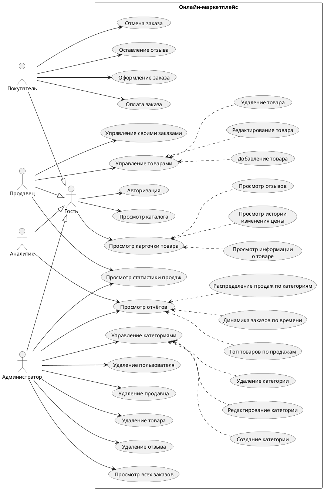

Редактируемый источник — [UseCases.puml](diagrams/src/UseCases.puml).
По согласованию со студентом добавлены три UC для F-4: «Оплата заказа» и «Отмена заказа»
для покупателя, «Управление своими заказами» для продавца. Просмотр, отправка
и отметка `delivered` относятся к последнему UC; технические шаги не выделяются
в самостоятельные варианты использования. Все три UC напрямую связаны со
своими акторами; PNG обновлён из редактируемого источника.

## ER-диаграмма

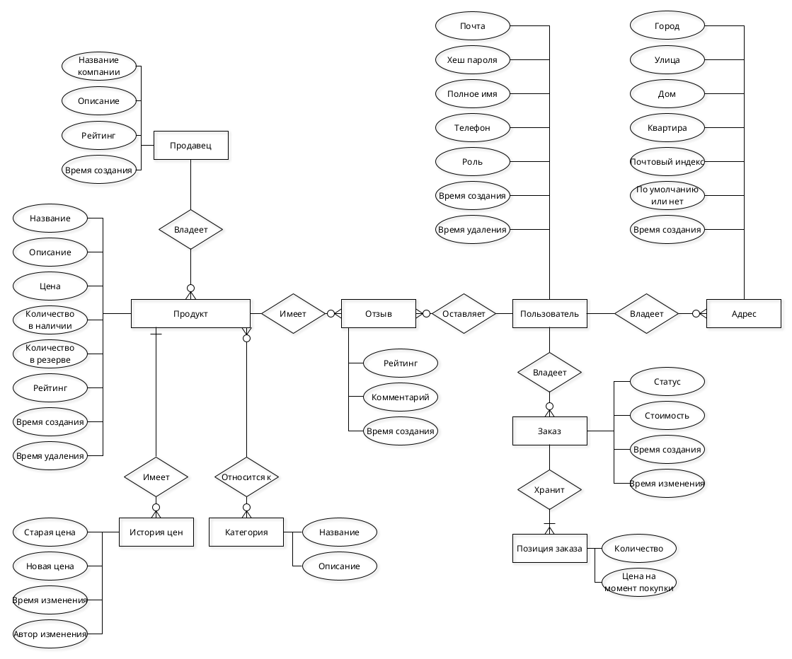

Редактируемый источник — [ER_Chen.graphml](diagrams/src/ER_Chen.graphml).

## Пользовательские сценарии

Критерии ниже задают ожидаемые результаты для будущей приёмки. Они повторно
сверены с кодом и проектными материалами при итоговой проверке 30.09.2026;
критерии четырёх сценариев приняты студентом 30.09.2026. Прохождение сценариев на работающем
стенде не проверялось. `delivered` означает отметку продавца после `shipped`;
система не подтверждает физическое получение товара покупателем.

### Сценарий 1. Покупатель собирает корзину и оформляет заказ

**Актор:** Покупатель

1. Покупатель открывает каталог и выбирает категорию «Электроника».
2. Система отображает список товаров категории (данные из PostgreSQL).
3. Покупатель открывает карточку смартфона, просматривает описание, цену и график истории цен.
4. Покупатель нажимает «В корзину». Система создаёт заказ в статусе `draft` (без адреса) и добавляет позицию в `order_items`.
5. Покупатель возвращается в каталог, находит чехол для смартфона и добавляет его в корзину — система добавляет вторую позицию в тот же заказ-черновик.
6. Покупатель открывает корзину и увеличивает количество чехлов до 3 штук. Система обновляет `quantity` в соответствующей позиции.
7. Покупатель нажимает «Оформить заказ». Система предлагает выбрать адрес доставки из адресной книги или добавить новый.
8. Покупатель выбирает адрес, помеченный как основной.
9. Система проверяет доступное количество каждого товара (`stock_quantity - reserved_quantity`), резервирует нужное количество, фиксирует текущие цены в `price_at_purchase` и переводит корзину из `draft` в `pending`. Для товаров одного продавца это один заказ; для товаров разных продавцов система создаёт отдельный `pending`-заказ для каждого продавца. У каждого заказа свой `total_amount` и выбранный адрес.
10. После одного действия оформления покупатель переходит к списку созданных заказов; суммы указаны отдельно для каждого заказа.
11. Покупатель оплачивает каждый `pending`-заказ через встроенный Mock Bank. После успешной оплаты статус соответствующего заказа становится `paid`.

**Альтернативный поток (шаг 7):** Если у покупателя нет сохранённых адресов, система требует ввести новый адрес перед оформлением.

**Альтернативный поток (шаг 9):** Если доступное количество хотя бы одного товара (`stock_quantity - reserved_quantity`) меньше запрошенного, система отклоняет оформление без частичного резерва и сообщает о нехватке товара.

**Альтернативный поток (шаг 11):** При отказе учебного банка заказ остаётся `pending`; если срок оплаты истёк, фоновый процесс отменяет его и освобождает резерв.

**Критерии приёмки:**

| Проверка | Проверяемый результат |
| --- | --- |
| Успех: товары двух продавцов, достаточный остаток, собственный адрес | Оформление создаёт ровно два `pending`-заказа, каждый содержит товары только своего продавца. Количества сохранены; `price_at_purchase` равна цене в момент оформления; сумма каждого заказа равна сумме его позиций. Складской остаток не меняется, резерв растёт на заказанное количество. |
| Успех: изменение количества в корзине и оплата | До оформления у покупателя не более одной корзины `draft`; изменение количества не создаёт вторую позицию того же товара. Для свежей корзины успешная оплата в пределах TTL переводит соответствующий заказ в `paid`, не меняя остаток и резерв. |
| Ошибка: чужой/несуществующий адрес, пустая корзина или нехватка хотя бы одного товара | Оформление отклонено с причиной. Состояние до и после совпадает: статус и позиции корзины, остатки и резервы; новых оформленных заказов нет. |
| Ошибка: отказ банка или истечение TTL | Отказ не переводит заказ в `paid`. Просроченный `pending`-заказ после обработки работающим фоновым процессом становится `cancelled`, резерв освобождается. |

Известное ограничение: TTL текущей реализации отсчитывается от создания корзины для одного продавца, а не от оформления. Поэтому успешный платёж выше проверяется на свежей корзине; случай старой корзины выделен в [BUG-001](docs/known-issues.md#bug-001-payment-ttl-starts-from-draft-cart-creation).

---

### Сценарий 2. Продавец публикует товар и отслеживает продажи

**Актор:** Продавец

1. Продавец открывает раздел управления своими товарами.
2. Продавец нажимает «Добавить товар» и заполняет форму: название, описание, цена, количество на складе.
3. Продавец выбирает одну или несколько категорий для товара (связь M:N через `product_categories`).
4. Система сохраняет товар в PostgreSQL.
5. Товар появляется в общем каталоге для покупателей.
6. Через некоторое время продавец решает снизить цену товара с 5 000 ₽ до 3 500 ₽ и редактирует карточку.
7. Триггер БД автоматически записывает изменение в `product_price_history` (старая цена, новая цена, дата).
8. Продавец открывает раздел «Статистика продаж», указывает период.
9. Система вызывает хранимую функцию `get_seller_statistics` и возвращает: количество заказов, общую выручку, средний чек и самый продаваемый товар.

Выбор периода поддерживает текущий JSON API. В существующем MPA статистика выводится за последний год; выбор периода на экране относится к будущему интерфейсу.

**Критерии приёмки:**

| Проверка | Проверяемый результат |
| --- | --- |
| Успех: валидный товар и существующие категории через MPA | Создан один товар с `seller_id` текущего продавца и выбранными связями `product_categories`; товар виден в каталоге и фильтре соответствующей категории. |
| Успех: изменение цены 5 000 → 3 500 | Текущая цена равна 3 500; в истории появилась запись именно об этом изменении со старой и новой ценой. Цены уже оформленных позиций заказа не изменились. |
| Успех: статистика через API за заданный период | Для подготовленных заказов `paid`, `shipped`, `delivered` своего продавца возвращаются количество уникальных заказов, сумма `quantity × price_at_purchase`, средняя сумма заказа и лидер по проданному количеству. Учитывается интервал `date_from ≤ created_at < date_to`; `draft`, `pending`, `cancelled` и товары другого продавца исключены. |
| Ошибка: изменение чужого товара или остатка ниже резерва | Запрос отклонён; данные товара и его история цены не изменились. |
| Ошибка ввода через JSON API: пустое название, цена ≤ 0, остаток < 0 или неверный формат даты | Запрос отклонён; товар не создан/не изменён, неверный период не используется для отчёта. |

JSON API пока не принимает `category_ids` в запросах создания и изменения товара, хотя MPA и сервис поддерживают категории. Полное представление шага 3 в будущем API нужно определить в контракте ЛР2.

Текущий `GET /api/v1/sellers/{id}/stats` публичен: расчёт ограничен указанным
продавцом, но вызывающий пользователь не проверяется. Критерий статистики
выше проверяет расчёт для своего продавца, не конфиденциальность отчёта.
Политику чтения статистики требуется явно задать в контракте ЛР2; NF-S
проверяет изменения данных, а не приватность этого чтения.

---

### Сценарий 3. Покупатель оставляет отзыв на полученный товар

**Актор:** Покупатель

1. Покупатель открывает раздел «Мои заказы» и видит заказ в статусе `delivered`.
2. Покупатель открывает карточку товара из этого заказа.
3. Покупатель нажимает «Оставить отзыв», выбирает оценку от 1 до 5 и пишет текстовый комментарий.
4. Система проверяет, что покупатель приобрёл товар в заказе со статусом `delivered`, а ограничение UNIQUE на пару (`user_id`, `product_id`) не допускает повторного отзыва.
5. Система сохраняет отзыв; триггер БД пересчитывает рейтинг товара и продавца.
6. При следующем просмотре карточки товара отзыв отображается другим пользователям.

**Альтернативный поток (шаг 4):** Если покупатель уже оставлял отзыв на этот товар, система отклоняет повторную попытку и предлагает отредактировать существующий отзыв.

**Критерии приёмки:**

| Проверка | Проверяемый результат |
| --- | --- |
| Успех: активный товар присутствует в своём `delivered`-заказе, отзыва ещё нет | Для оценки 1–5 создана одна запись с текущим `user_id` и выбранным `product_id`; текст и оценка сохранены, отзыв доступен в публичном списке. Рейтинги в PostgreSQL пересчитаны по триггеру. |
| Ошибка: товар не куплен или заказ ещё `paid`/`shipped` | Создание отклонено, новая запись не появилась, рейтинги не изменились. |
| Ошибка: второй отзыв на тот же товар или оценка вне 1–5 | Создание отклонено; прежний отзыв и рейтинги сохранены. Собственный отзыв можно изменить отдельным действием. |
| Ошибка: изменение чужого отзыва | Запрос отклонён, автор, текст и оценка исходного отзыва не изменились. |

Отзыв читается без кэша; рейтинг в карточке товара при включённом Redis может оставаться прежним до TTL `products:{id}`. Это [ограничение исходной реализации](docs/cache.md#product-cache-behavior), а не подтверждённое мгновенное обновление интерфейса.

### Сценарий 4. Продавец исполняет оплаченный заказ

**Акторы:** Продавец; покупатель может отменить свой заказ до отправки и наблюдает его статус.

1. Продавец открывает список своих заказов и выбирает заказ `paid`.
2. После подготовки отправления продавец отмечает его как отправленное.
3. Система проверяет роль, принадлежность и статус; в одной транзакции переводит заказ в `shipped` и уменьшает складской остаток и резерв на количество позиций.
4. Продавец отмечает заказ как доставленный; система проверяет принадлежность и переход `shipped → delivered`, не факт физического получения.
5. Покупатель видит `delivered` и получает право оставить отзыв. Отдельная интеграция с перевозчиком и подтверждение доставки покупателем не реализованы.

**Альтернативный поток до отправки:** Покупатель отменяет свой `paid`-заказ. Система в одной транзакции переводит его в `cancelled` и освобождает резерв, не меняя физический остаток. Если заказ уже отправлен или принадлежит другому покупателю, отмена отклоняется без изменений этим запросом.

**Критерии приёмки:**

| Проверка | Проверяемый результат |
| --- | --- |
| Успех: отправка своего `paid`-заказа | Заказ становится `shipped`; для каждой позиции остаток и резерв уменьшаются ровно на её количество. |
| Успех: доставка своего `shipped`-заказа | Заказ становится `delivered`; дополнительного списания остатка и резерва нет; покупатель видит этот статус своего заказа. |
| Успех: покупатель отменяет свой `paid`-заказ до отправки | Заказ становится `cancelled`; резерв уменьшается на количество позиций, физический остаток не меняется. |
| Ошибка: чужой заказ, неверный статус или повторная отправка | Действие отклонено; статус и количества не меняются, повторного списания нет. |
| Ошибка сохранения при отправке | Транзакция откатывается: статус, остатки и резервы сохраняют значения до операции. |

### Связи сценариев для проектирования API ЛР2

| Сценарий | Требование | Сущности | Будущий экран и текущий MPA | Опорные материалы |
| --- | --- | --- | --- | --- |
| 1. Корзина, оформление и оплата | F-1–F-4 | `users`, `addresses`, `orders`, `order_items`, `products`, `sellers` | [Эскизы 1–4](diagrams/src/screen-sketches.md); `/`, `/products/{id}`, `/cart`, `/orders`, `/orders/{id}`, Mock Bank | [Жизненный цикл](docs/order-lifecycle.md), [оплата](docs/payments.md), ADR-1/ADR-2 |
| 2. Публикация и продажи | F-1, F-5 | `sellers`, `products`, `categories`, `product_categories`, `product_price_history`, `orders`, `order_items` | [Эскиз 5](diagrams/src/screen-sketches.md); `/seller`, `/seller/products`, форма редактирования; выбор периода на экране планируется | [Карта компонентов](docs/project-map.md), [схема](diagrams/src/schema.dbml) |
| 3. Отзыв после доставки | F-1, F-6 | `users`, `reviews`, `products`, `sellers`, `orders`, `order_items` | [Эскизы 2 и 4](diagrams/src/screen-sketches.md); `/orders/{id}`, `/products/{id}` | [Правила доступа](docs/order-lifecycle.md#access-rules), [схема](diagrams/src/schema.dbml) |
| 4. Исполнение заказа и отмена | F-4 | `users`, `sellers`, `orders`, `order_items`, `products` | [Эскизы 4 и 5](diagrams/src/screen-sketches.md); `/seller/orders`, `/orders/{id}` | BPMN исполнения заказа ниже; [переходы и остатки](docs/order-lifecycle.md) |

Сущности сверены с DBML, действия — с сервисами и маршрутами API/MPA. Текущие маршруты перечислены в [инвентаризации API](docs/api-contracts.md); она не заменяет утверждённый OpenAPI-контракт. Для ЛР2 связи выше должны определять операции, данные и ошибочные исходы контракта после приёмки студентом.

## BPMN-диаграммы

По уточнению студента от 30.09.2026 преподаватель согласовал **две BPMN —
Checkout и Fulfillment**. Это согласованное исключение из письменного требования
«не менее 3» (стр. 3 задания); вопрос количества процессов закрыт. Обе диаграммы
имеют нелинейные ветви. Принятие количества не закрывает TD-001/TD-002.

### Оформление заказа

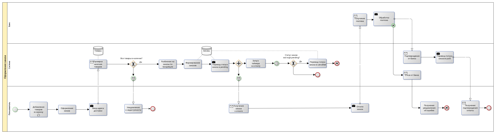

Редактируемый исходник — [BPMN_Checkout.graphml](diagrams/src/BPMN_Checkout.graphml),
[PDF](diagrams/out/BPMN_Checkout.pdf). Известные расхождения этой диаграммы с
правилами резервирования отложены в [TD-002](docs/known-issues.md#td-002-checkout-bpmn-stock-reservation).

### Исполнение оплаченного заказа

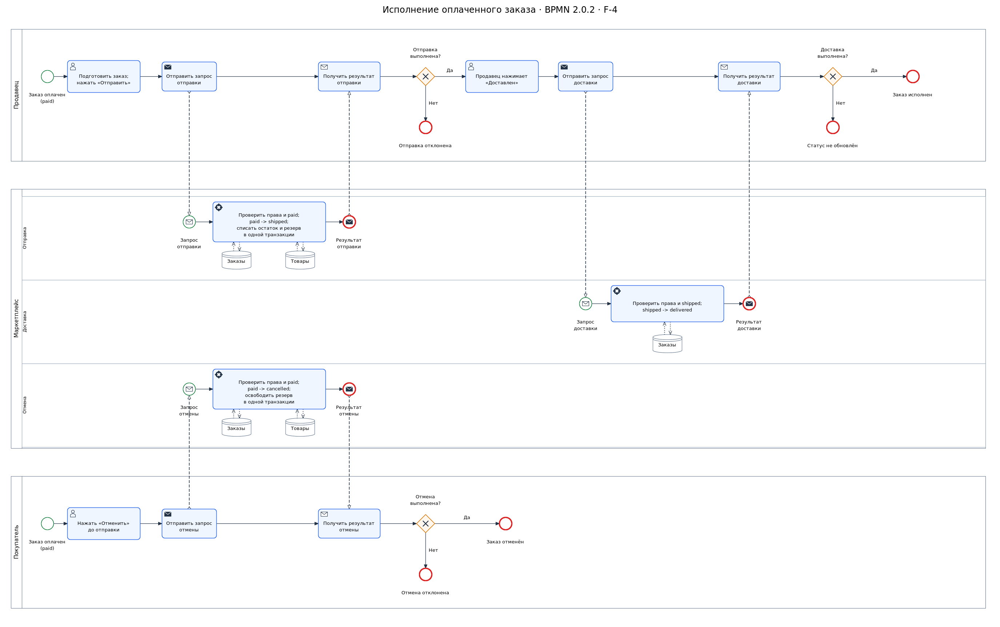

[Редактируемый источник для yEd](diagrams/src/BPMN_Fulfillment.graphml),
[BPMN 2.0 XML с координатами DI](diagrams/src/BPMN_Fulfillment.bpmn),
[векторное превью](diagrams/out/BPMN_Fulfillment.svg),
[PDF из yEd](diagrams/out/BPMN_Fulfillment.pdf).
По [BPMN 2.0.2](https://www.omg.org/spec/BPMN/2.0.2/PDF) участники разделены на три
пула: продавец, маркетплейс и покупатель. Внутри маркетплейса три дорожки
группируют обработку отправки, доставки и отмены; они не являются отдельными
сервисами. Оформление и устройство пулов/дорожек приняты студентом. Ручная
[копия Романа](diagrams/src/BPMN_Fulfillment_Roman.graphml) сохраняется отдельно
и не перезаписывается генератором.

Процесс соответствует F-4 и сценарию 4: покупатель запрашивает отмену оплаченного заказа до отправки либо продавец отправляет его и затем вручную выставляет `delivered`. Для всех трёх действий сервис проверяет права на заказ и исходный статус. Шлюзы «Отмена выполнена?», «Отправка выполнена?» и «Доставка выполнена?» проверяют результат запроса; последний означает успешную смену `shipped -> delivered`, не проверку получения посылки. Видимый комментарий с диаграммы удалён по просьбе студента. Отмена освобождает резерв, отправка списывает остаток и резерв в одной транзакции. Отказ не изменяет данные этим запросом и завершает попытку, не сам заказ; поэтому здесь обычный конец ветки, не Error End или Cancel End.

Типы элементов выбраны по смыслу: User Task для работы в интерфейсе, Send/Receive Task для запросов и ответов, Service Task для обработки, Message Start/End для начала обработки и отправки результата. Sequence Flow остаются внутри пула; Message Flow соединяют разные пулы. Направленные Data Association различают чтение и запись в «Заказы»/«Товары»; повторяющиеся значки ссылаются на те же два хранилища. Каждый запрос запускает отдельную обработку, а не долгоживущий серверный процесс на заказ. Сообщения не означают очередь, push-уведомления или новые функции продукта. Отмена `pending` вне этой диаграммы; её исходное условие — `paid`.

Проверены 28 элементов потока, 23 Sequence Flow, 6 Message Flow и 10 видимых
ассоциаций с хранилищами, ссылки, направления событий, условия трёх шлюзов и
привязка ответов к их условиям. Все связи прямые, без поворотов; проверены
границы дорожек, блоков и подписей. При итоговой проверке повторно прошли XSD
OMG, локальная проверка `--check-only` и 14 регрессионных тестов генератора. В предыдущем цикле
GraphML просмотрен в yEd; сейчас PNG и существующий одностраничный PDF
визуально сверены после растеризации PDF, обрезанных блоков и потерянных ветвей
не выявлено. Модель описательная (`isExecutable=false`), не исполняемый процесс
и не утверждённый API-контракт. Вспомогательные генератор и его тесты использовались
локально и по решению студента не включаются в коммиты. Редактируемые GraphML
и BPMN XML/DI, а также PDF/PNG/SVG сохраняются; дальнейшие правки выполняются
в исходниках диаграмм с обновлением соответствующих экспортов.

## Тип приложения и технологический стек

**Тип приложения:** Web MPA (Multi-Page Application). Go-сервер формирует HTML на основе шаблонов (`html/template`) и отдаёт готовые страницы браузеру. Отдельного фронтенд-приложения нет.

**Упрощение оплаты:** Mock Bank встроен в то же Go-приложение и предназначен для локальной демонстрации; реального банка и отдельного платёжного сервиса сейчас нет. Дорожка банка на BPMN изображает логического участника процесса, а не отдельный развёрнутый сервис.

**Технологический стек:**

| Слой               | Технология             | Назначение                                         |
| ------------------ | ---------------------- | -------------------------------------------------- |
| Язык               | Go 1.25+               | Серверная часть                                    |
| HTTP-роутер        | chi                    | Маршрутизация, middleware                          |
| Шаблонизатор       | html/template (stdlib) | Рендеринг HTML на сервере                          |
| Фронтенд           | HTML, CSS, JavaScript  | Страницы MPA; JavaScript используется для графиков |
| Фреймворк фронтенда | Нет                   | Отдельное браузерное приложение не развёрнуто       |
| Технологический UI | console (stdlib)       | Системное тестирование Use Case через service-слой |
| РСУБД              | PostgreSQL 16          | Основное хранилище данных                          |
| Драйвер БД         | pgx/v5 + pgxpool       | Пул соединений с PostgreSQL                        |
| Query builder      | squirrel               | Построение SQL-запросов                            |
| InMemory СУБД      | Redis 8                | Опциональный кэш карточек товаров по ID             |
| Redis-клиент       | go-redis/v9            | Работа с Redis из Go                               |
| Локальная доставка | Go-процесс + Docker Compose | Go-сервер запускается отдельно; Compose запускает PostgreSQL и Redis |
| Миграции           | goose                  | Версионирование схемы БД                           |

Текущий способ запуска описан в [инструкции по настройке](docs/setup.md). Стенд маршрутизации и развёртывания WebLab#4 пока не реализован.

## Архитектурные решения

[ADR ЛР1](docs/ADR.md) фиксируют два выбранных решения: резервирование товара при оформлении и корзину как заказ в статусе `draft`. Для каждого приведены альтернативы, причины выбора и последствия.

## Диаграмма БД в нотации DBML

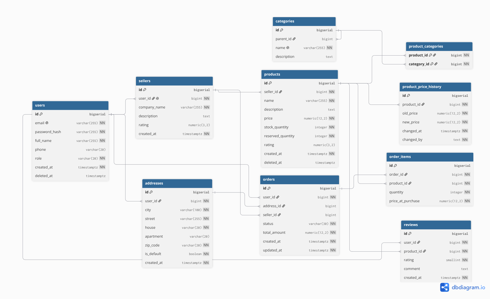

[Редактируемый исходник схемы БД](diagrams/src/schema.dbml).

## Диаграмма последовательности оформления заказа

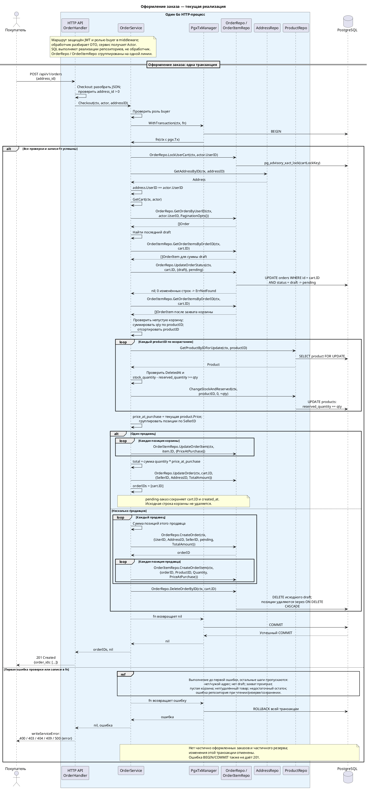

[Редактируемый PlantUML](diagrams/src/SeqCheckoutComponent.puml),
[векторный экспорт для просмотра с увеличением](diagrams/out/SeqCheckout.svg).
По запросу студента диаграмма актуализирована по текущему коду и ограничена
только checkout: проверка адреса и существующей корзины, её захват,
упорядоченные `FOR UPDATE`, резерв и фиксация цены.
Ветви одного и нескольких продавцов различаются; при ошибке показан откат
всей транзакции. Добавление/изменение корзины и оплата в эту схему не входят;
отдельная платёжная диаграмма не добавляется. Сохранено переиспользование
строки корзины и её `created_at` в ветви одного продавца. Это описание
текущей реализации, не OpenAPI-контракт.
Уточнение sequence-диаграммы не исправляет отложенный Checkout BPMN (TD-002).

## Черновые экраны будущего web-приложения

[Редактируемые эскизы экранов](diagrams/src/screen-sketches.md) показывают каталог, карточку товара и отзыв, корзину, заказы, кабинет продавца и рабочие места администратора и аналитика.

## C4-диаграммы

### L1 — Контекст системы

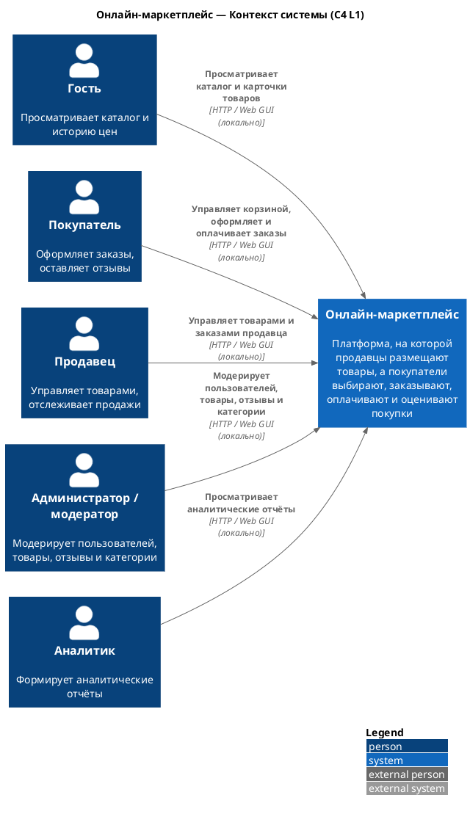

### L2 — Контейнеры

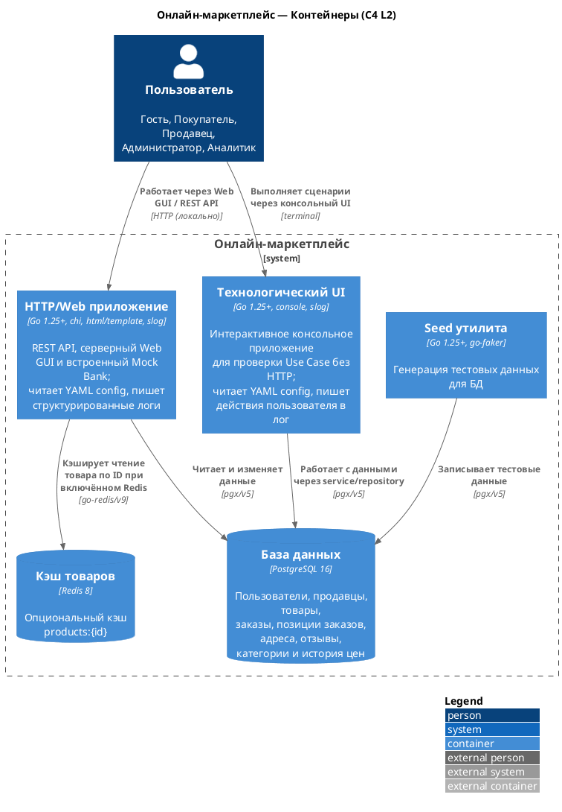

### L3 — Компоненты

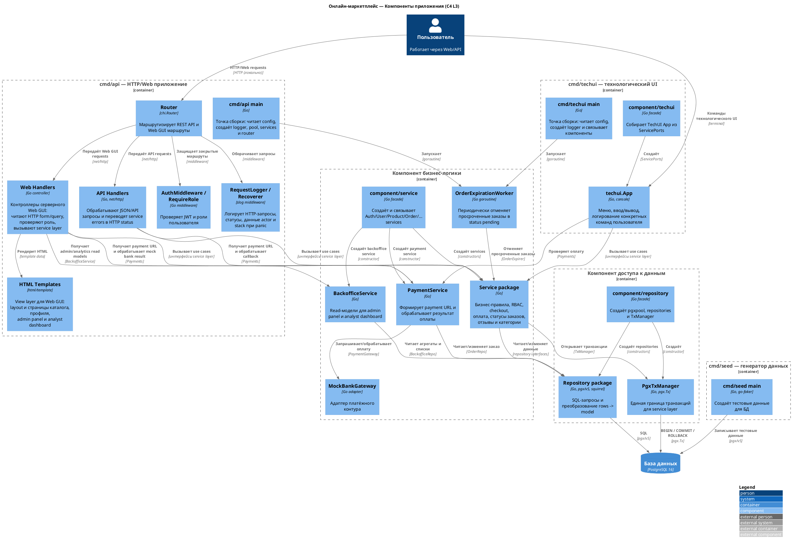

### L4 — Классы

#### Компонент пользовательского Web GUI

Пользовательский GUI реализован как server-side MPA: Go-приложение принимает HTTP-запросы, вызывает сервисы бизнес-логики и рендерит HTML через `html/template`. Текущие части MPA соотносятся с MVC/MV* следующим образом:

- Controller: `web.WebHandler` и `web.NewWebRouter`;
- View: HTML-шаблоны `internal/web/templates/*.html` и статические стили;
- Model/Application layer: структуры `model`, сервисы `service` и репозитории `repository`.

`WebHandler` не выполняет SQL напрямую: страницы admin panel и analyst dashboard получают данные через `BackofficeService`, а SQL-запросы находятся в `BackofficeRepo`.

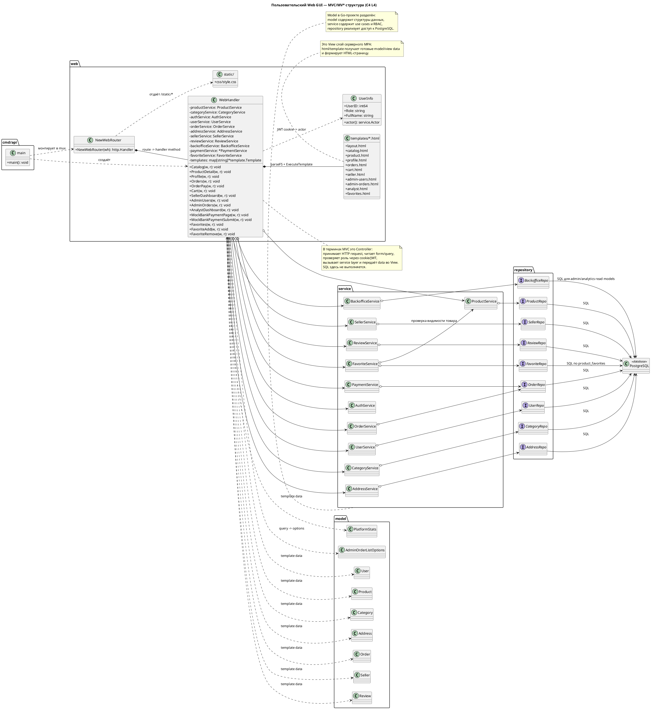

#### Компонент технологического UI

Технологический UI реализован как отдельная команда `cmd/techui`. Консольное приложение не обращается к HTTP-обработчикам и использует те же сервисы бизнес-логики, что и web/API слой: `AuthService`, `UserService`, `ProductService`, `OrderService`, `PaymentService` и остальные сервисы предметной области. Это позволяет проходить пользовательские сценарии регистрации, каталога, корзины, оформления и оплаты заказа, управления товарами продавца, статистики, отзывов, адресов, категорий и администрирования напрямую через компонент бизнес-логики.

Запуск:

```bash
DATABASE_URL="postgres://..." go run ./cmd/techui
```

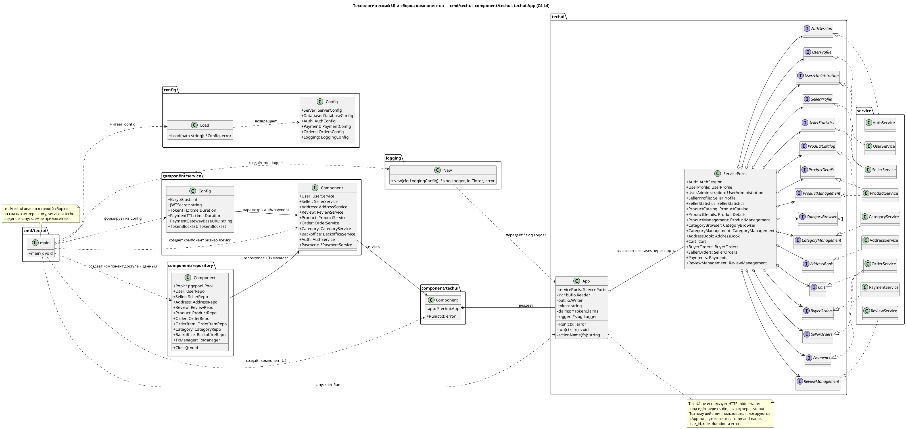

#### Компонент доступа к данным (Repository)

Реализации и DB entities (пакет `repository`):

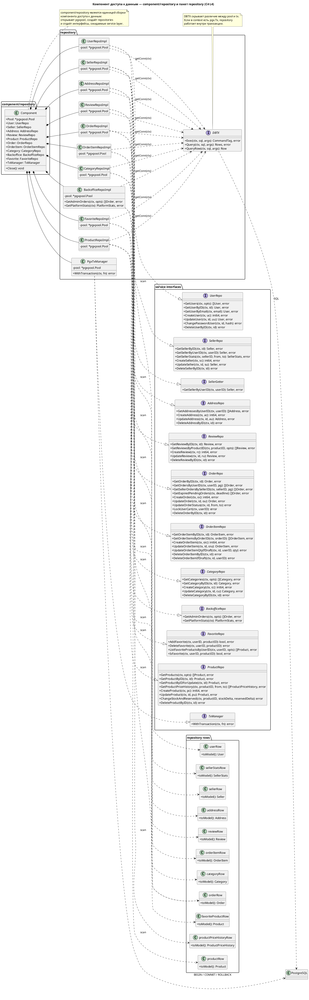

#### Компонент бизнес-логики (Service)

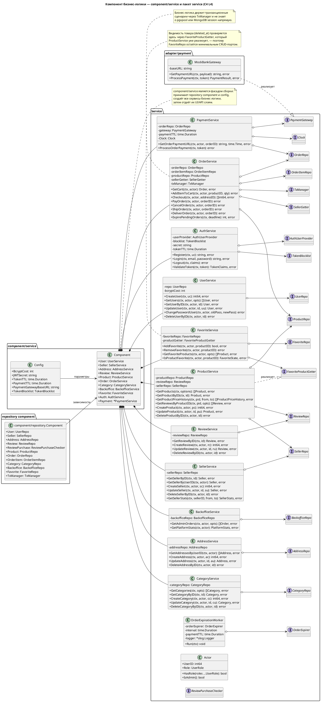

## ИИ-трек ЛР1: проверка комплекта

Предыдущий отдельный разбор дополнен итоговой проверкой Codex от 30.09.2026:
задание (стр. 2–4), [карта проекта](docs/project-map.md), сценарии, эскизы,
исходники Use Case/C4/DBML, BPMN и два ADR сверены между собой и с текущими
сервисами, обработчиками и миграциями. Ограничения реализации и будущие
требования отделены от исправлений. Редактируемые исходники сохранены в
`diagrams/src/`.

### Проверка пунктов задания

Наличие артефакта, техническая проверка и принятие студентом — отдельные статусы.

| Пункт | Артефакт и результат проверки | Принятие |
| --- | --- | --- |
| 7a. Цель и проблема | Начало README: маркетплейс независимых продавцов и учебная оплата; границы совпадают с картой проекта. | Принято в составе итогового комплекта. |
| 7b. Требования | F-1–F-6 и измеримые NF-P/NF-R/NF-S; критерии относятся к существующим маршрутам. NF не измерялись. | NF-цели и стенд приняты студентом как цели будущих проверок. |
| 7c. Use Case | В PlantUML добавлены три UC для F-4 с прямыми связями с акторами; PNG обновлён. | Согласованная минимальная правка принята в составе итогового комплекта. |
| 7d. BPMN | Checkout и Fulfillment: GraphML, PNG и PDF; Fulfillment также XML/DI и SVG. XML и модель проверены. | Два процесса согласованы с преподавателем; Fulfillment принят; TD-002 отложен. |
| 7e. Сценарии; ИИ-приёмка | Четыре сценария с успехом/ошибкой и связями F-ID → сущность → экран; правила сверены с исходниками. | Критерии приняты студентом; выполнение на стенде не заявляется. |
| 7f. ER | Chen GraphML и PNG существуют; известные пропущенные связи перечислены в TD-001. | Исправление отложено, полная согласованность не заявляется. |
| 7g. Стек и доставка | Таблица стека сверена с `go.mod`, Compose и `cmd/api`; Go-процесс запускается отдельно от БД/Redis. | Принято в составе итогового комплекта. |
| 7h. Диаграмма БД | DBML и PNG существуют; ключевые сущности, ссылки, резервы и ограничения сопоставлены с миграциями. | Принято в составе итогового комплекта. |
| 7i. C4 | L1–L3: PlantUML и PNG; роли, один HTTP-процесс, PostgreSQL, опциональный Redis и service/repository сверены с wiring. | Принято в составе итогового комплекта. |
| 7j. Эскизы | Шесть редактируемых текстовых эскизов покрывают четыре сценария; будущие элементы управления указаны отдельно. | Принято как наброски ЛР1, не как дизайн будущей SPA. |
| 7k. ADR | Два ADR с альтернативами, причинами и последствиями соответствуют checkout и хранению корзины. | Выбраны и приняты студентом. |
| ИИ: исходный проект и контекст | Карта компонентов/ограничений и AGENTS с границами, ссылками и командами подготовлены; предыдущие проверки запуска отмечены в AI_REVIEW. | Контекст принят в составе итогового комплекта. |
| ИИ: ревью, решения и передача | Разбор ниже различает исправления, техдолг, ограничения и будущие требования; решения студента записаны отдельно. | Остальные материалы и восемь тематических коммитов приняты; коррекция sequence по R-16 выполнена и проверена агентом. |

### Разбор противоречий

| Несогласованность | Вывод и состояние |
| --- | --- |
| ER Chen пропускает связи, присутствующие в DBML | [TD-001](docs/known-issues.md#td-001-er-chen-missing-entity-relationships): исправление явно отложено студентом, согласованность ER пока не подтверждена. |
| Checkout BPMN не показывает резервирование и освобождение резерва из ADR-1/F-3 | [TD-002](docs/known-issues.md#td-002-checkout-bpmn-stock-reservation): исправление явно отложено студентом; новая BPMN этого долга не закрывает. |
| Карта проекта утверждала, что ADR ещё нет | Исправлено: два выбранных студентом решения существуют в [ADR.md](docs/ADR.md), с альтернативами и последствиями. |
| Устаревшее ожидание третьей BPMN после добавления Fulfillment | Исправлено по уточнению студента: преподаватель согласовал две BPMN как исключение из письменного минимума. Вопрос количества закрыт. |
| Документация ожидала экспорт PDF Fulfillment и повторное принятие его оформления | Исправлено: PDF существует и визуально проверен, оформление и пулы/дорожки приняты студентом. Существенных ошибок при итоговой сверке не выявлено. |
| [Use Case](diagrams/src/UseCases.puml) не отражал оплату, отмену и работу продавца с заказами из F-4 | Исправлено по согласованию со студентом: добавлены «Оплата заказа», «Отмена заказа» и «Управление своими заказами», обновлён PNG. Переходы статусов и технические шаги не вынесены в отдельные UC. |
| Шаг выбора категорий сценария 2 поддержан MPA/сервисом, но не DTO текущего JSON API | Ограничение отражено в сценарии и карте проекта. Для ЛР2 требуется определить операции и данные контракта; сейчас OpenAPI не утверждён. |
| Старый `draft` одного продавца может не получить ожидаемого времени на оплату после checkout | Подтверждён [BUG-001](docs/known-issues.md#bug-001-payment-ttl-starts-from-draft-cart-creation); ограничение учтено в критериях и обоих ADR, способ исправления не выбран. |
| Рейтинг в БД пересчитывается сразу, но карточка может читать старое значение из Redis | В сценарии 3 отделено обновление PostgreSQL от отображения; поведение кэша описано как ограничение, а не гарантия мгновенного обновления. |
| Выбор периода на эскизе продавца шире текущего MPA | Период поддержан API; MPA сейчас показывает последний год. Управление периодом на экране остаётся проектным требованием. |
| `delivered` может читаться как подтверждение получения покупателем | Уточнено в сценариях: продавец меняет статус, система проверяет права и переход. Подтверждение покупателем и перевозчик отсутствуют. |
| Учебная оплата может восприниматься как защищённая интеграция с банком | Ограничение реализации: Mock Bank встроен в приложение, его base64-токен не подписан, записей платежей нет. NF-S проверяет защищённые операции приложения, а callback выделен за пределы этой цели; [платёжные ограничения](docs/payments.md#current-limitations) сохраняются. |
| Изменение остатка через старую форму и потеря полей при поиске категории | Открытые [BUG-002/BUG-003](docs/known-issues.md) исходного MPA; успешные критерии используют актуальную форму и валидный ввод. Исправление кода не входит в ЛР1. |
| Эскизы и инвентаризация маршрутов могут восприниматься как готовые SPA/OpenAPI | Будущие требования: контракт создаётся в ЛР2; стенд, нагрузка и сервисы — ЛР4–ЛР6. SPA относится к ЛР8 вне выбранного пути. |
| Дополнительная sequence-диаграмма checkout устарела | Исправлено по запросу студента: [исходник](diagrams/src/SeqCheckoutComponent.puml), PNG и SVG отражают текущий checkout, транзакцию/резерв и обе ветви по продавцам. После ревью добавление в корзину и оплата исключены из схемы. TD-002 относится к отдельной BPMN и остаётся отложенным. |
| Проверка отзывов при документальном ревью отличалась от исходного коммита `7ad0f94` | В исходной версии разрешены также `paid`/`shipped`. Прежние правки `delivered` сначала проверялись в worktree и не вошли в документальную версию `a36b45e`; по последующему запросу студента проверены тестами PostgreSQL и отдельно зафиксированы в `8110c79`, форма MPA — в `41c000d`. Расхождение текущего кода с F-6 устранено; эта история не относится к TD-001/TD-002. |
| Роли UC/эскизов не описывают публичное чтение статистики продавца | Ограничение текущего API: `/api/v1/sellers/{id}/stats` смонтирован без auth, сервис не принимает actor. Сценарий 2 проверяет формулы и период, не приватность. Явная политика чтения — вопрос будущего контракта ЛР2; изменение кода и расширение UC сейчас не выполнялись. |

### Решения студента по результатам анализа

R-1–R-7 сохранены из предыдущего журнала ревью; R-1/R-2/R-5 и выбранные ADR
подтверждены студентом в задании итоговой проверки. Новые решения — R-8–R-18.
Критерии сценариев, NF-цели и остальные материалы приняты; согласованная
коррекция границ sequence выполнена и проверена агентом.

| ID | Решение | Причина и результат |
| --- | --- | --- |
| R-1 | Отложить исправление ER Chen | Студент прямо указал, что сейчас исправлять не будет; расхождения сохранены как TD-001 для последующей работы. |
| R-2 | Отложить исправление checkout BPMN | По указанию студента исправление вынесено в TD-002; текущая работа — дополнительный процесс и ИИ-часть ЛР1. |
| R-3 | Исправить утверждение об отсутствии ADR | Оно расходится с существующим `docs/ADR.md`; карта проекта теперь ссылается на два принятых решения. |
| R-4 | Добавить Fulfillment к Checkout | Предыдущее замечание преподавателя требовало ещё один процесс; схема подготовлена. Актуальное согласование количества записано в R-8. |
| R-5 | Одинаково трактовать три шлюза исполнения заказа | По уточнению студента это результат действия в системе; «Доставка выполнена?» означает смену статуса, не проверку получения посылки. Трактовка сохранена в описании процесса. |
| R-6 | Делать вторую схему по BPMN 2.0.2 | Студент выбрал строгую нотацию вместо переноса условностей checkout: отдельные пулы участников, осмысленные типы задач, событий и связей. |
| R-7 | Убрать видимый комментарий о доставке | По просьбе студента пояснение осталось в README и метаданных, не на рисунке. |
| R-8 | Считать две BPMN достаточными | Студент сообщил о подтверждении преподавателя; это согласованное уточнение письменного требования, третья BPMN не требуется. |
| R-9 | Принять оформление Fulfillment и сохранить существующий PDF | Студент подтвердил принятие пулов/дорожек и наличие экспорта; схема не переделывается без существенной ошибки, ручная копия сохраняется. |
| R-10 | Добавить ровно три UC с прямыми связями с акторами | Студент согласовал минимальное покрытие F-4: оплата/отмена для покупателя, управление своими заказами для продавца; технические шаги остаются внутри целей. |
| R-11 | Принять критерии четырёх сценариев | Студент принял показанные success/error критерии с явными ограничениями TTL, Redis и текущего API; выполнение сценариев на стенде не утверждается. |
| R-12 | Принять NF-P/NF-R/NF-S и предложенный стенд | Студент принял измеримые цели производительности, надёжности и безопасности на i5-13500H, 16 ГБ, Ubuntu 24.04 для будущих проверок; достигнутые значения не заявляются. |
| R-13 | Актуализировать sequence-диаграмму по текущему коду | Студент отклонил историческую пометку и запросил обновление; первоначальная версия также содержала корзину и оплату. После ревью границы уточнены в R-16; TD-002 не закрыт. |
| R-14 | Разделить фиксацию материалов по областям, без скриптов генерации | Студент согласовал остальные 46 файлов из показанного списка и попросил несколько тематических коммитов с конкретным кратким описанием. Генератор Fulfillment и его тесты исключены; локальные файлы не удаляются. Согласование состава файлов не означает приёмку ещё обсуждаемого оформления sequence. |
| R-15 | Писать сообщения коммитов на русском об уже сделанном | Студент установил постоянное правило: русский заголовок/текст, прошедшее время вместо инфинитива. Тематический план из восьми коммитов принят; правило закреплено в AGENTS и руководстве по стилю. |
| R-16 | Ограничить sequence только оформлением заказа | Студент принял остальное и явно исключил добавление в корзину и оплату из этой диаграммы. Выполнена согласованная коррекция исходника и PNG/SVG; проверена агентом, повторный просмотр результата студентом не заявляется. |
| R-17 | Удалить четыре дублирующих файла инструкций, сохранив правила РПЗ | Студент согласовал удаление вложенных AGENTS из service/repository/cache/migrations с локальными копиями. Корневые инструкции и профильная документация сохранены; DBCourseWork/AGENTS.md не удалён. |
| R-18 | Зафиксировать прежние Go/HTML-правки и завершить очистку worktree | Студент согласовал 17 файлов в пяти дополнительных коммитах, включая новые сервисные/шаблонные тесты, удалённый PNG и актуализацию документации. Скрипты допускаются в репозиторий только при реальном использовании; агент оценил их как разовые помощники и добавил точечные правила в глобальный Git ignore, сохранив локальные файлы. |

### Состояние передачи в ЛР2

Контекст агента и планируемые проверки находятся в [AGENTS.md](AGENTS.md), реальный цикл работы — в [AI_REVIEW.md](AI_REVIEW.md). Требования, четыре сценария с критериями, связи с сущностями и экранами, два ADR и ревью приняты студентом с коррекцией границ sequence по R-16. Коррекция выполнена и проверена агентом; дополнительная приёмка нового изображения студентом не заявляется.

Документальная версия ЛР1 зафиксирована восемью тематическими коммитами,
завершающимися `a36b45e`: 46 согласованных файлов без вспомогательных скриптов.
Дополнительных исходников или экспортов для оплаты не добавлено.
TD-001/TD-002 передаются как отложенный долг, BUG-001–BUG-003 — как открытые
ограничения реализации. Их исправление сейчас не является задачей подготовки
ЛР1. BPMN, их количество, PDF и выбор ADR повторного решения не требуют.
Принятый комплект передаётся в ЛР2 из ветки `lab1`
вместе с таблицей связей сценариев. Документальная проверка
не подтверждает работу всех функций на стенде. По последующему запросу студента
ранее подготовленные правки F-6 отдельно проверены и зафиксированы в `8110c79`
(правило отзыва) и `41c000d` (форма MPA). Добавлены тесты сервисного метода
и шаблона; прошли полный Go-набор с отдельной PostgreSQL, race-проверки
сервиса/MPA и `go vet`. Они не выдаются за NF-измерения или выполнение
следующей лабораторной; TD-001/TD-002 и BUG-001–BUG-003 остаются открытыми.
