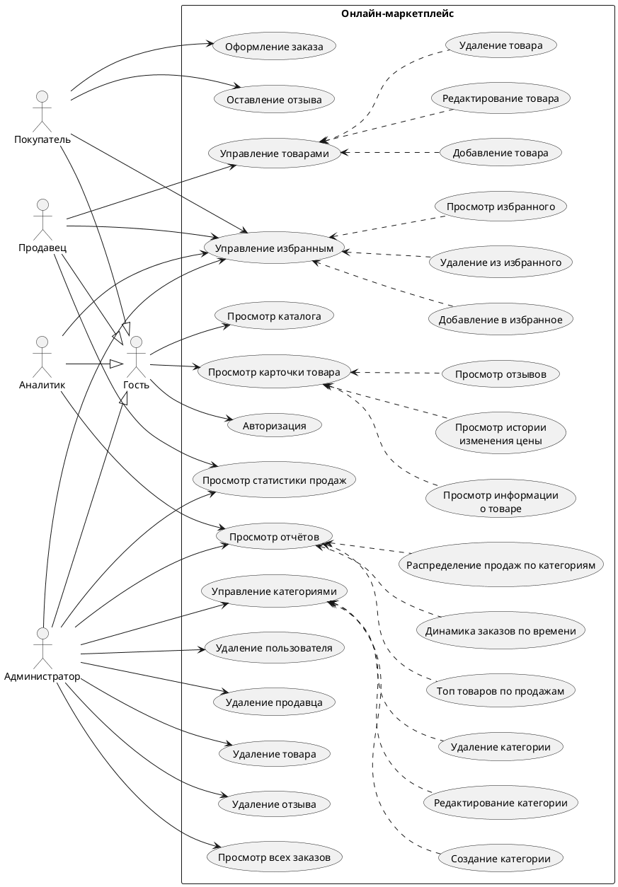
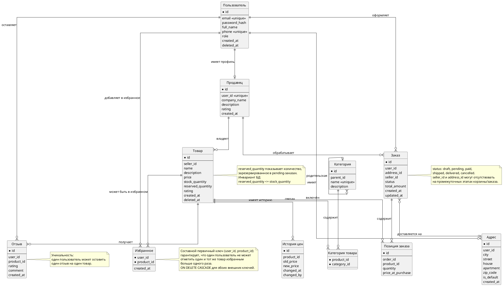
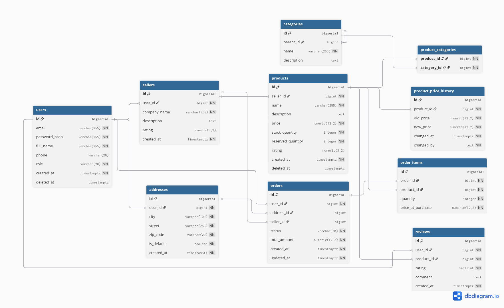
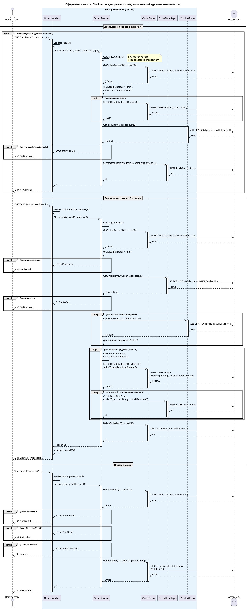
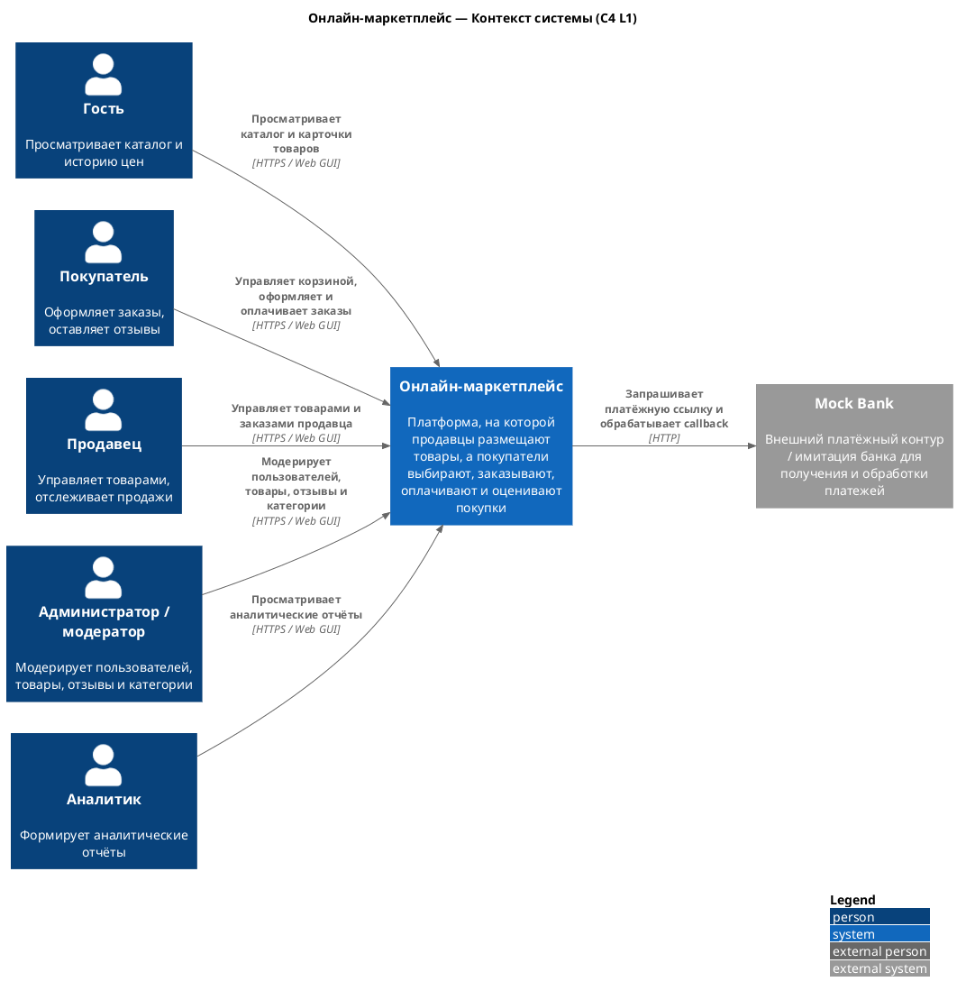
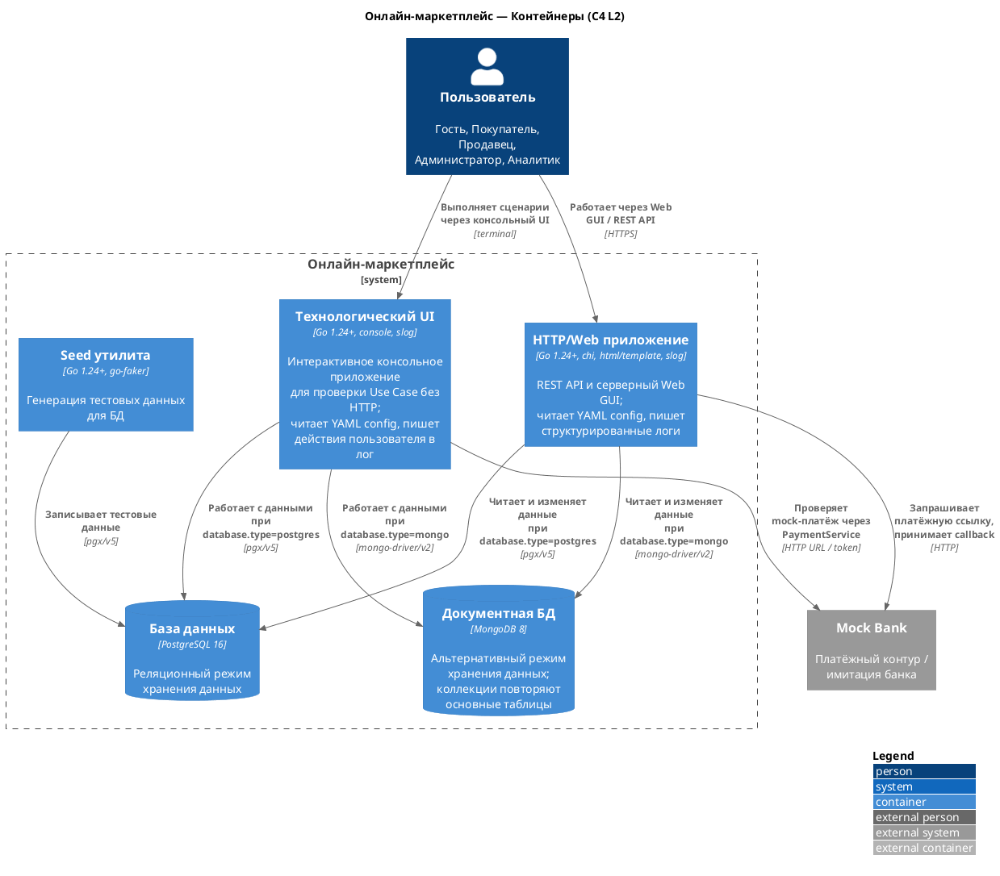
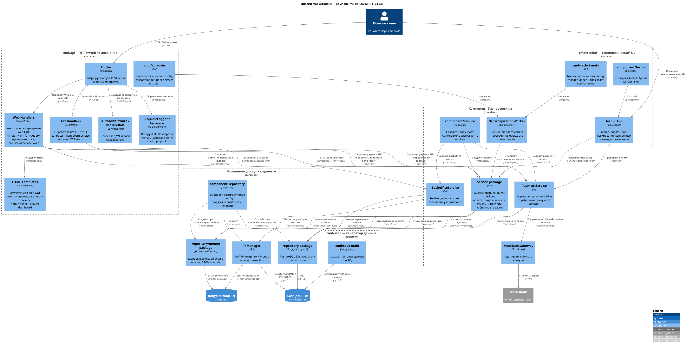
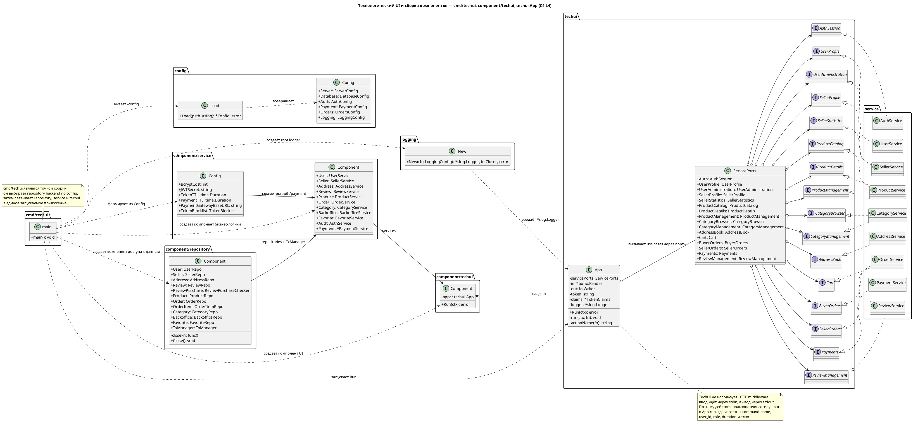
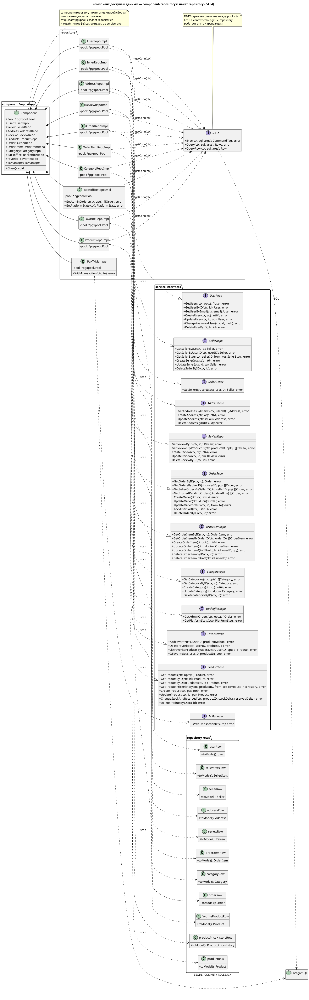
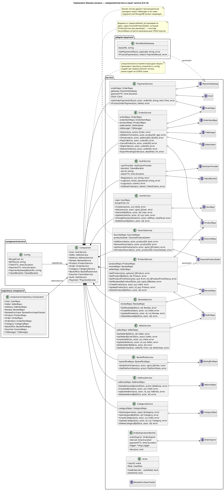

# Онлайн-маркетплейс

## Описание проекта

Веб-приложение онлайн-маркетплейса — платформы, где независимые продавцы размещают товары, а покупатели выбирают и заказывают их через единый каталог. Система обеспечивает управление товарами, оформление заказов, оставление отзывов и аналитику продаж. Серверная часть реализована на Go с использованием PostgreSQL и Redis.

## Предметная область

Онлайн-маркетплейс — это электронная торговая площадка, на которой множество независимых продавцов размещают свои товары, а покупатели выбирают и заказывают их через единый интерфейс. В отличие от классического интернет-магазина, маркетплейс не владеет товарами, а выступает посредником: предоставляет каталог с категориями, систему заказов, отзывы и рейтинги. Ключевые бизнес-процессы включают регистрацию продавца, публикацию товара, оформление заказа покупателем, отслеживание статуса доставки и формирование аналитической отчётности.

## Анализ аналогов

Для сравнения выбраны три крупнейших маркетплейса, доступных российским пользователям. Критерии отражают программные характеристики платформ, значимые при проектировании собственной системы.

**Критерий 1 — API для продавцов.** Наличие и зрелость публичного API определяет возможность автоматизации и интеграции со сторонними системами (1С, CRM, аналитические сервисы). Это ключевая техническая характеристика платформы для продавцов.

**Критерий 2 — Встроенная аналитика продаж.** Возможность получить статистику продаж, выручки и динамику заказов средствами самой платформы, без покупки сторонних сервисов. Различия между платформами здесь существенны.

**Критерий 3 — Система рейтингов и отзывов.** Архитектура системы обратной связи: наличие раздельных рейтингов товара и продавца, верификация покупки, возможности медиа-контента в отзывах. Влияет на доверие покупателей и сложность реализации.

| Критерий                    | Ozon                                                                                                                         | Wildberries                                                                                                                                                        | AliExpress                                                                                                                        | Наш проект                                                                    |
| --------------------------- | ---------------------------------------------------------------------------------------------------------------------------- | ------------------------------------------------------------------------------------------------------------------------------------------------------------------ | --------------------------------------------------------------------------------------------------------------------------------- | ----------------------------------------------------------------------------- |
| API для продавцов           | [Seller API](https://docs.ozon.ru/api/seller/) с OAuth-авторизацией, покрывает товары, заказы, аналитику, финансы            | [WB API](https://dev.wildberries.ru) с токен-авторизацией, покрывает товары, заказы, поставки, продвижение                                                         | [Open API](https://openservice.aliexpress.com/doc/api.htm), требует регистрации продавца, ориентирован на трансграничную торговлю | REST API (товары, заказы, отзывы, статистика продавца), открытый исходный код |
| Встроенная аналитика продаж | Расширенная аналитика в личном кабинете, часть функций доступна по подписке [Ozon Premium](https://docs.ozon.ru/api/seller/) | Базовая аналитика; для расширенной требуются сторонние сервисы ([обзор сервисов](https://vc.ru/marketplace/2035503-luchshie-servisy-analitiki-marketpleysov-2025)) | Базовая аналитика в кабинете продавца                                                                                             | Статистика через хранимую функцию PostgreSQL, доступ по REST API              |
| Система рейтингов и отзывов | Рейтинг товара + рейтинг продавца ([источник](https://www.insales.ru/blogs/university/ozon-vs-wildberries))                  | Только рейтинг товара, нет отдельного рейтинга продавца ([источник](https://www.insales.ru/blogs/university/ozon-vs-wildberries))                                  | Рейтинг товара + рейтинг продавца                                                                                                 | Рейтинг товара (1–5), один отзыв на товар от покупателя, ограничение UNIQUE   |

## Целесообразность и актуальность

По данным [АКИТ (Ассоциация компаний интернет-торговли)](https://finance.rambler.ru/economics/56067709-akit-obem-internet-torgovli-v-rossii-v-2025-godu-vyros-na-28/), объём интернет-торговли в России по итогам 2025 года составил 11,5 трлн рублей (рост 28% год к году), а доля онлайн-продаж достигла 18,8% от всего розничного товарооборота. Маркетплейсы являются основным драйвером этого роста. При этом все крупные платформы — закрытые коммерческие продукты. Проект служит одновременно курсовой работой по дисциплине «Базы данных» и pet-project'ом для портфолио Go-разработчика, демонстрирующим работу с PostgreSQL, Redis и чистой архитектурой.

## Акторы (роли)

| Актор             | Описание                                                                                         |
| ----------------- | ------------------------------------------------------------------------------------------------ |
| **Гость**         | Неавторизованный пользователь: просматривает каталог, историю цен, может авторизоваться          |
| **Покупатель**    | Просматривает каталог, оформляет заказы, управляет адресами доставки, оставляет отзывы на товары |
| **Продавец**      | Регистрирует профиль компании, публикует и редактирует товары, просматривает статистику продаж   |
| **Администратор** | Управляет пользователями и категориями, имеет полный доступ ко всем данным системы               |
| **Аналитик**      | Имеет доступ на чтение ко всем данным для формирования отчётов и анализа                         |

## Диаграмма вариантов использования (Use Case)



## ER-диаграмма



## Пользовательские сценарии

### Сценарий 1. Покупатель собирает корзину и оформляет заказ

**Актор:** Покупатель

1. Покупатель открывает каталог и выбирает категорию «Электроника».
2. Система отображает список товаров категории (данные из Redis-кэша или PostgreSQL).
3. Покупатель открывает карточку смартфона, просматривает описание, цену и график истории цен.
4. Покупатель нажимает «В корзину». Система создаёт заказ в статусе `draft` (без адреса) и добавляет позицию в `order_items`.
5. Покупатель возвращается в каталог, находит чехол для смартфона и добавляет его в корзину — система добавляет вторую позицию в тот же заказ-черновик.
6. Покупатель открывает корзину и увеличивает количество чехлов до 3 штук. Система обновляет `quantity` в соответствующей позиции.
7. Покупатель нажимает «Оформить заказ». Система предлагает выбрать адрес доставки из адресной книги или добавить новый.
8. Покупатель выбирает адрес, помеченный как основной.
9. Система проверяет наличие каждого товара на складе, фиксирует текущие цены в `price_at_purchase`, рассчитывает `total_amount`, привязывает адрес к заказу и переводит статус из `draft` в `pending`.
10. Покупатель видит подтверждение заказа с итоговой суммой.

**Альтернативный поток (шаг 7):** Если у покупателя нет сохранённых адресов, система требует ввести новый адрес перед оформлением.

**Альтернативный поток (шаг 9):** Если одного из товаров нет в наличии (`stock_quantity` < запрошенного количества), система отклоняет оформление и уведомляет покупателя, какой именно товар недоступен.

---

### Сценарий 2. Продавец публикует товар и отслеживает продажи

**Актор:** Продавец

1. Продавец открывает раздел управления своими товарами.
2. Продавец нажимает «Добавить товар» и заполняет форму: название, описание, цена, количество на складе.
3. Продавец выбирает одну или несколько категорий для товара (связь M:N через `product_categories`).
4. Система сохраняет товар и инвалидирует кэш каталога в Redis.
5. Товар появляется в общем каталоге для покупателей.
6. Через некоторое время продавец решает снизить цену товара с 5 000 ₽ до 3 500 ₽ и редактирует карточку.
7. Триггер БД автоматически записывает изменение в `product_price_history` (старая цена, новая цена, дата).
8. Продавец открывает раздел «Статистика продаж», указывает период.
9. Система вызывает хранимую функцию `get_seller_statistics` и возвращает: количество заказов, общую выручку, средний чек и самый продаваемый товар.

---

### Сценарий 3. Покупатель оставляет отзыв на полученный товар

**Актор:** Покупатель

1. Покупатель открывает раздел «Мои заказы» и видит заказ в статусе `delivered`.
2. Покупатель открывает карточку товара из этого заказа.
3. Покупатель нажимает «Оставить отзыв», выбирает оценку от 1 до 5 и пишет текстовый комментарий.
4. Система проверяет ограничение UNIQUE на пару (`user_id`, `product_id`) — один пользователь может оставить только один отзыв на товар.
5. Система сохраняет отзыв и инвалидирует кэш карточки товара в Redis.
6. При следующем просмотре карточки товара отзыв отображается другим пользователям.

**Альтернативный поток (шаг 4):** Если покупатель уже оставлял отзыв на этот товар, система отклоняет повторную попытку и предлагает отредактировать существующий отзыв.

## BPMN-диаграммы

### Оформление заказа


## Тип приложения и технологический стек

**Тип приложения:** Web MPA (Multi-Page Application). Go-сервер формирует HTML на основе шаблонов (`html/template`) и отдаёт готовые страницы браузеру. Отдельного фронтенд-приложения нет.

**Технологический стек:**

| Слой               | Технология             | Назначение                                         |
| ------------------ | ---------------------- | -------------------------------------------------- |
| Язык               | Go 1.24+               | Серверная часть                                    |
| HTTP-роутер        | chi                    | Маршрутизация, middleware                          |
| Шаблонизатор       | html/template (stdlib) | Рендеринг HTML на сервере                          |
| Технологический UI | console (stdlib)       | Системное тестирование Use Case через service-слой |
| РСУБД              | PostgreSQL 16          | Основное хранилище данных                          |
| Драйвер БД         | pgx/v5 + pgxpool       | Пул соединений с PostgreSQL                        |
| Query builder      | squirrel               | Построение SQL-запросов                            |
| InMemory СУБД      | Redis 7                | Кэширование, хранение сессий                       |
| Redis-клиент       | go-redis/v9            | Работа с Redis из Go                               |
| Контейнеризация    | Docker + Compose       | Среда разработки и деплоя                          |
| Миграции           | goose                  | Версионирование схемы БД                           |

## Диаграмма БД в нотации DBML


## Диаграмма последовательности для Оформления заказа


## C4-диаграммы

### L1 — Контекст системы



### L2 — Контейнеры



### L3 — Компоненты



### L4 — Классы

#### Компонент технологического UI

Технологический UI реализован как отдельная команда `cmd/techui`. Консольное приложение не обращается к HTTP-обработчикам и использует те же сервисы бизнес-логики, что и web/API слой: `AuthService`, `UserService`, `ProductService`, `OrderService`, `PaymentService` и остальные сервисы предметной области. Это позволяет проходить пользовательские сценарии регистрации, каталога, корзины, оформления и оплаты заказа, управления товарами продавца, статистики, отзывов, адресов, категорий и администрирования напрямую через компонент бизнес-логики.

Запуск:

```bash
DATABASE_URL="postgres://..." go run ./cmd/techui
```



#### Компонент доступа к данным (Repository)

Реализации и DB entities (пакет `repository`):



#### Компонент бизнес-логики (Service)


